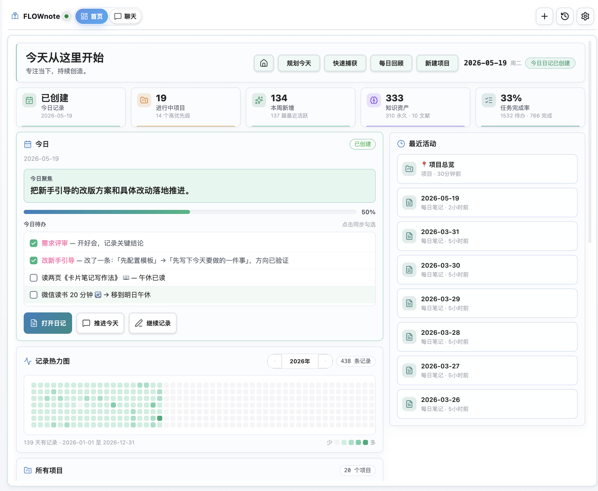
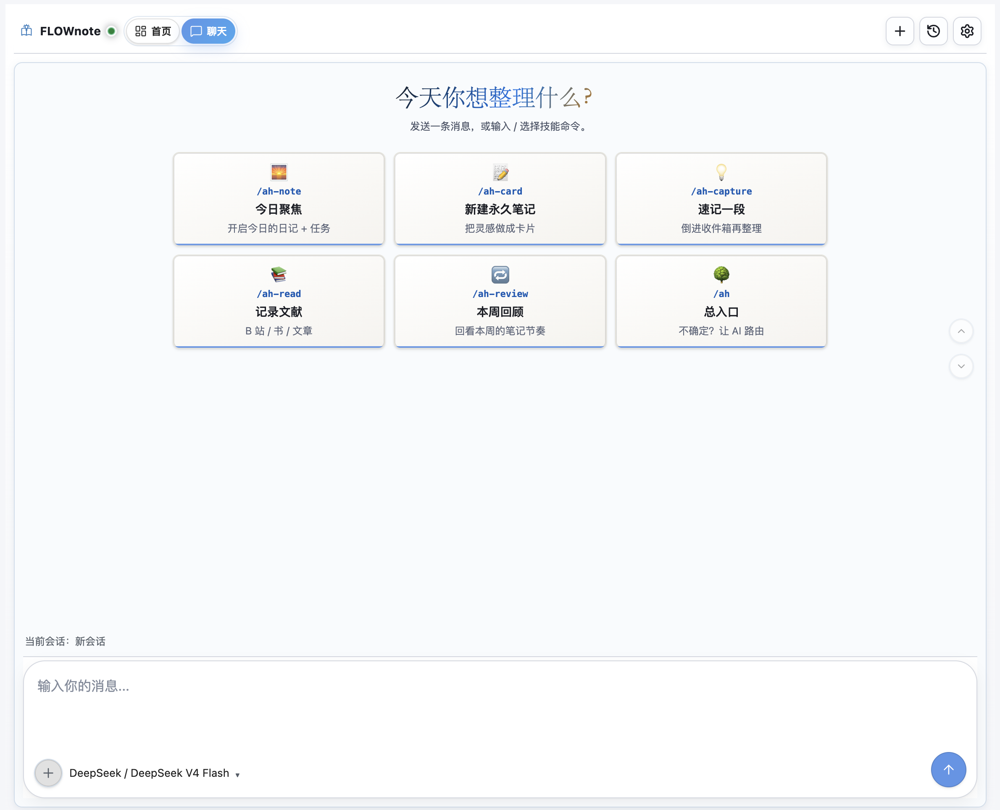
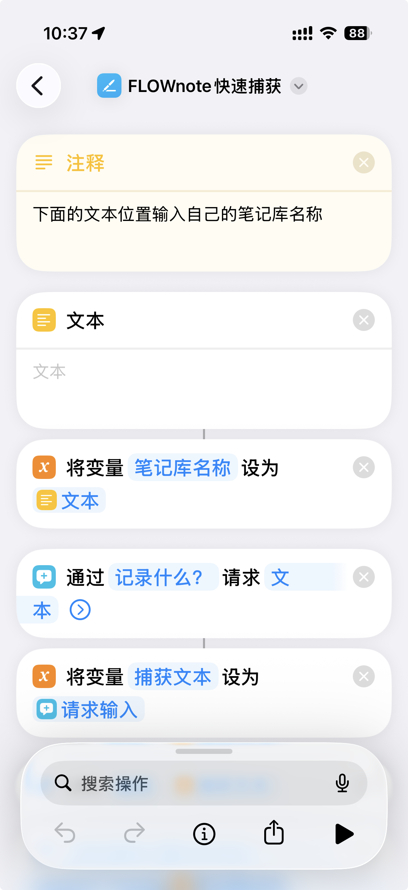

# FLOWnote

<p align="center">
  
</p>

语言：**简体中文** | [English](#english)

**FLOWnote 是一个面向 Obsidian 的 AI 笔记工作台：打开就是个人首页，随手捕获、每日计划、项目推进、知识资产统计、AI 对话和技能工作流都在同一个空间里完成。**

> FLOWnote 默认使用用户自行配置的 AI API Key，在桌面端和移动端都可运行。OpenCode 仍作为可选的桌面端桥接模式保留，适合已经习惯旧工作流的用户。

## 产品预览

<p align="center">
  
</p>

<p align="center">
  
</p>

## 0.5.6 更新亮点

0.5.6 把 FLOWnote 从「AI 聊天侧栏 + 捕获工具」推进到「Obsidian 里的个人知识工作台」。这次合并了 0.5.1 的发布健康度修复，加入全新的首页、iOS 快捷指令和一批移动端体验优化，并修复记忆文件位置兼容与本地 Ollama 模型配置问题。

- **全新首页 Dashboard**：打开 FLOWnote 即可看到今日状态、今日日记、今日聚焦、待办进度、快捷动作、最近活动、项目进展、知识资产统计和记录热力图，不再从笔记列表里慢慢找入口。
- **今日日记深度联动**：首页会读取真实每日笔记内容，展示今日待办并支持直接勾选；勾选后会同步修改原始 Markdown 复选框，并保持页面滚动位置。
- **项目总览升级**：首页会聚合所有项目，展示状态、优先级、分类、待办/完成数量、截止时间和进度条；宽屏可并排浏览，小窗口和移动端会自动收敛为单列。
- **记录热力图**：基于每日笔记统计捕获/记录数量，提供年度热力图和年份切换，帮助用户看到自己的记录节奏。
- **快捷动作入口**：首页顶部提供规划今天、快速捕获、每日回顾、新建项目、打开主页文档等高频动作，桌面端和移动端都做了空间适配。
- **iOS 快捷指令支持**：设置页新增 FLOWnote 快速捕获快捷指令入口，提供 iCloud 快捷指令安装链接，并自动显示当前笔记库名称，用户复制到快捷指令的「文本」栏即可使用。
- **移动端快速捕获优化**：快速捕获面板重做为更适合手机的输入体验，修复键盘弹起后输入区被遮挡或漂移的问题，并继续支持 AI 文本清理、链接解析和降级保留原文。
- **移动端聊天体验修复**：恢复聊天页快速启动卡片、设置按钮位置、浅色模式气泡和顶部/底部遮挡适配，避免首页和聊天页互相干扰。
- **内置 AI 工作流继续完善**：新安装用户默认使用内置直连 API 模式；直连模式具备 Obsidian 原生工具链能力，包括读取、写入、搜索、每日笔记、任务、标签、反链、属性、文件移动和目录创建等。
- **Skills 与第三方 API 能力**：支持导入完整外部 skill 文件夹；`web_request` 支持 POST、Authorization header、JSON body 和 `$SECRET` 占位符，可用于微信读书等 API 型技能。
- **设置与 Provider 体验优化**：移动端捕获模型支持从服务商接口刷新模型列表；修复服务商、模型等设置项刷新后回跳的问题；OpenCode 桥接模式仍保留给旧用户。
- **记忆文件位置兼容修复**：自动兼容并迁移旧版 `.ai-memory/` 记忆目录到 `ai-memory/`，同时工具读取/写入会识别旧路径，避免 iCloud/移动端同步场景下读不到记忆文件。
- **本地 Ollama 支持**：Agent 服务商新增 Ollama 本机模式，默认连接 `http://localhost:11434/v1` 且无需 API Key；当桌面端使用 Ollama 时，可在 Ollama 配置下单独设置手机端可访问的云端模型，用于移动端聊天和快速捕获 AI 清理。
- **界面与发布健康度清理**：移除 `styles.css` 中的 `!important` 强覆盖，整理移动端浅色模式、设置页折叠箭头、模型选择器、logo、复制按钮、滚动导航等样式细节。
- **隐私、稳定性与测试覆盖**：补充 README 隐私、联网、Vault 访问、剪贴板、本地环境读取说明；OpenCode 子进程只转发白名单环境变量；自动化测试覆盖首页、移动端、快捷指令、直连 Agent、权限策略、skills 导入、模板管理和路径链接等核心路径。

## 这套系统在解决什么问题

大多数笔记系统都在同一个地方崩掉：想法积压的速度永远快过你处理它的速度，几周后超过 70% 的笔记再也没被打开。FLOWnote 押的是一件很朴素的事——**只要把"把一条想法向前推一步"这件事的摩擦做得足够小，你就真的会日复一日地做下去。** 这个押注，叫做 **FLOW 笔记法**。

```
捕获 → 加工 → 连接 → 输出
 F      L      O      W
 ↓      ↓      ↓      ↓
日记   永久   领域   项目
想法   笔记   页面   产出
```

- **F · 捕获（Feed）**——白天一键扔进今日日记，不挑文件夹、不纠结标签。
- **L · 加工（Lift）**——把碎想法淬炼成永久笔记：原子化、断言式标题、AI 协助找相关链接。
- **O · 连接（Organize）**——"领域页"是你的工作桌；做哪件事就摊开哪张桌子，相关笔记自己浮出来。
- **W · 输出（Work）**——项目自动落地为结构化目录，配合每日/每周/每月/每年复盘把闭环跑起来。

`bundled-skills/` 里的技能包负责所有机械动作（编号、目录、链接维护、索引刷新），你只管想清楚下一步写什么、想什么、做什么。

## 视频教程（B 站）

完整方法论拆解，作者在 B 站发布了 **FLOW 笔记法** 系列：

📺 **[B 站 · FLOW 笔记法合集](https://space.bilibili.com/24543451/lists/7386412?type=season)**

| 期数 | 主题 |
|---|---|
| 第 1 期 | 入门篇——系统全貌 + 每天 15 分钟工作流 |
| 第 2 期 | 阅读篇——从划线到文献笔记 |
| 第 3 期 | 永久笔记篇——原子化、断言式标题、AI 辅助制卡 |
| 第 4 期 | 知识连接篇——主题页 vs 领域页 |
| 第 5 期 | 项目与复盘篇——周/月/年三层复盘 |
| 第 6 期 | AI 总览篇——完整环境配置（制作中） |

## 使用前提

- Obsidian v1.5.0+
- 使用内置 AI 工作流时，配置一个支持的服务商 API Key，或自定义 OpenAI 兼容接口
- 可选桌面桥接：如果想让 FLOWnote 连接外部 OpenCode 运行时，再安装 [OpenCode 官网](https://opencode.ai) / [GitHub](https://github.com/anomalyco/opencode)
- 移动端如果需要 AI 清理或链接解析，按需配置第三方 API Key

## 核心能力

### 首页工作台

- 今日状态、今日日记创建状态和今日聚焦
- 今日待办读取与原文复选框同步
- 快捷动作：规划今天、快速捕获、每日回顾、新建项目、打开主页文档
- 最近活动、所有项目、知识资产统计和年度记录热力图
- 桌面端、小窗口和移动端响应式布局

### 桌面端 AI 工作区

- 会话侧栏与历史持久化
- 流式回复、重试、取消
- 模型/Provider 切换与 Provider 鉴权处理
- 内置直连 API 模式，支持 FLOWnote 自己的技能与工具编排
- 可选 OpenCode 桥接模式，兼容既有桌面端 OpenCode 使用习惯
- 连接诊断（Provider、可执行文件路径、启动方式、连接失败定位）

### 内置技能（自动同步）

- 插件内置技能位于 `bundled-skills/`
- 启动时会自动同步到 Vault 技能目录（默认 `.opencode/skills`）
- FLOWnote 仅启用内置技能 ID（避免混入非预期技能）
- 技能注入模式：`summary`（推荐）、`full`、`off`

### 移动端快速捕获

- 一键捕获到每日笔记
- iOS 快捷指令快速捕获入口，可通过系统快捷指令把文本直接送入 FLOWnote
- 可选 AI 文本清理（口语转记录）
- 链接解析与降级链路：
  - 解析服务三选一：`TianAPI` / `ShowAPI` / `Gugudata`
  - 解析失败且已配置 AI：回退 AI
  - 无解析服务且无 AI Key：保留纯文本
- 所有方案都保留原始 URL
- 已包含 iOS 键盘遮挡兜底

<p align="center">
  
</p>

## 内置技能清单

| 技能 | 作用 |
|---|---|
| `ah` | 统一入口：菜单 + 意图路由 |
| `ah-note` | 创建今日日记并初始化计划 |
| `ah-capture` | 低摩擦记录想法到每日笔记 |
| `ah-inbox` | 批量整理想法并分流（卡片/任务/已处理） |
| `ah-read` | 阅读划线整理与文献笔记处理 |
| `ah-card` | 洞见转永久笔记并推荐知识链接 |
| `ah-think` | 思维模型工具箱（费曼、第一性原理、逆向等） |
| `ah-review` | 每日回顾与反思流程 |
| `ah-week` | 周回顾（统计 + 残留想法处理） |
| `ah-month` | 月回顾与策略复盘 |
| `ah-project` | 项目结构自动创建 |
| `ah-archive` | 项目归档与经验提炼 |
| `ah-index` | 知识库 AI 索引维护 |
| `ah-memory` | 跨技能记忆与进度状态规范 |

## 命令

- `打开`——打开 FLOWnote 聊天视图
- `发送选中文本`——把当前选中内容发送过去
- `新建会话`——开一个新会话
- `快速捕获想法`（移动端）

## 安装

完整的中文安装与模型配置教程见 `[[FLOWnote 安装与模型配置指南]]`。

### 社区插件安装

在 Community Plugins 搜索 `FLOWnote` 安装。然后在 FLOWnote 设置里选择内置直连 API 模式，或可选的 OpenCode 桥接模式。

### 手动安装

将以下文件放入：

`<Vault>/.obsidian/plugins/flownote/`

- `main.js`
- `manifest.json`
- `styles.css`

然后在 Obsidian 里重载插件。

## 配置

### 桌面端

1. 打开 FLOWnote 设置
2. 如果想用自己的服务商 API Key 且不依赖本机外部工具，保持默认的内置 AI 模式
3. 只有在想连接桌面端 OpenCode 运行时时，才选择 OpenCode 桥接模式。此时先安装 Node.js，再执行 `npm install -g opencode-ai`，并确认 `opencode` 命令可用
4. OpenCode 桥接模式下，CLI 路径建议先留空自动探测，必要时再填绝对路径；Windows 不再支持 WSL 安装

### 移动端

移动端使用 FLOWnote 内置 AI Provider 路径。受移动端沙盒限制，它不能从手机里启动桌面端 OpenCode CLI。

1. 配置 AI Provider（或自定义 OpenAI 兼容地址）
2. 如需链接解析，配置解析服务 Provider 与 Key
3. 设置每日笔记路径与想法区域标题

## 隐私、数据与联网披露

### 账户要求

- FLOWnote 本身不要求单独注册账号
- 第三方 AI/解析服务需用户自行配置凭据

### 数据存储

- 插件状态保存在 `data.json`（Obsidian 标准方式）
- 捕获内容写入用户笔记（如每日笔记）

### 笔记库与剪贴板访问

FLOWnote 需要调用以下 Obsidian API 才能跑通技能工作流，每一处调用都可在 `runtime/` 源码中复核：

- **笔记库枚举**（`vault.getFiles`、`vault.getMarkdownFiles`）——用于文件 @-提及选择器，以及让技能按名字定位笔记
- **笔记库读取**（`vault.read`、`vault.cachedRead`）——把选中笔记送入聊天上下文与技能提示词
- **笔记库写入**（`vault.create`、`vault.modify`）——追加捕获内容、保存聊天输出、把技能结果落进你的笔记
- **剪贴板访问**——仅用于聊天视图内的"复制消息/代码"按钮。FLOWnote 不主动读取剪贴板，复制操作均由用户触发

### 本地系统访问

当启用 OpenCode 桥接模式或 CLI 诊断时，FLOWnote 可能需要在磁盘上找到 OpenCode CLI。它仅读取以下标准环境变量**用于路径解析**，不做遥测、不做指纹采集：

- `os.homedir()` 与 `process.env.USERPROFILE`——获取用户主目录，用于解析 `~` 开头的路径
- `process.env.APPDATA`、`process.env.LOCALAPPDATA`——Windows 专用，用来查找 OpenCode 与 Node 的默认安装位置
- `process.env.PATH`、`process.env.PATHEXT`——用于搜索 `opencode` 可执行文件

FLOWnote 不调用 `os.hostname`、`os.userInfo`、`os.networkInterfaces`，也不会把上述任何值发到本机以外。
启动可选的 OpenCode 子进程时，FLOWnote 只转发白名单内的路径、语言、代理、证书和 AI 服务商相关环境变量，而不是完整继承 Obsidian 进程环境。

### 遥测

- FLOWnote 不包含独立遥测/行为上报通道
- 调试日志仅在本地控制台输出，受 `debugLogs` 控制

### 可能访问的网络地址（仅在用户启用相关功能后）

- AI 服务（示例）：
  - `api.deepseek.com`、`platform.deepseek.com`
  - `dashscope.aliyuncs.com`、`dashscope.console.aliyun.com`
  - `api.moonshot.cn`、`platform.moonshot.cn`
  - `open.bigmodel.cn`
  - `api.siliconflow.cn`、`cloud.siliconflow.cn`
  - 用户自定义端点
- 链接解析服务：
  - `apis.tianapi.com`、`www.tianapi.com`
  - `route.showapi.com`、`www.showapi.com`
  - `api.gugudata.com`、`www.gugudata.com`
- 可选桌面端本地 OpenCode 服务通信（`127.0.0.1` / `localhost`）
- OpenCode 官网文档/安装地址（`opencode.ai`）

### 费用说明

- FLOWnote 插件本身免费
- 第三方 API 可能按服务商规则收费

## 开发

```bash
npm run ci
npm run build:release
npm run check:submission
```

Release 产物位于 `release/`：

- `release/main.js`
- `release/manifest.json`
- `release/styles.css`

## 致谢

- 感谢 [OpenCode](https://github.com/anomalyco/opencode) 提供运行时与 SDK 基础能力
- 感谢 [Claudian](https://github.com/YishenTu/claudian) 提供最初灵感
- 感谢 [Obsidian](https://obsidian.md) 提供插件 API

## 许可证

FLOWnote 采用 MIT 许可证。

---

## English

Language: [简体中文](#flownote) | **English**

**FLOWnote is an AI note workspace for Obsidian: a dashboard home, quick capture, daily planning, project progress, knowledge metrics, AI chat, and skill workflows in one place.**

> FLOWnote works with user-configured AI API keys by default on desktop and mobile. OpenCode remains available as an optional desktop bridge for users who prefer the legacy workflow.

## Product Preview

<p align="center">
  
</p>

<p align="center">
  
</p>

## What's New in 0.5.6

0.5.6 turns FLOWnote from an AI chat sidebar plus capture tool into a personal knowledge workspace inside Obsidian. It includes the 0.5.1 release-health fixes, a new dashboard home, iOS Shortcuts support, broad mobile polish, plus fixes for memory-file location compatibility and local Ollama model setup.

- **New dashboard home**: Opening FLOWnote now shows today's state, daily note, focus, task progress, quick actions, recent activity, project progress, knowledge metrics, and an activity heatmap.
- **Daily note integration**: The home view reads real daily-note content, displays today's tasks, and lets users toggle checkboxes while syncing the original Markdown and preserving scroll position.
- **Project overview**: FLOWnote aggregates all projects with status, priority, category, open/done tasks, due dates, and progress bars. Wide screens can show project cards side-by-side; narrow and mobile layouts collapse cleanly.
- **Activity heatmap**: Daily-note capture counts are rendered as a yearly heatmap with year switching, making the user's recording rhythm visible.
- **Quick actions**: Plan today, quick capture, daily review, new project, and open home document actions are available from the home header with responsive desktop/mobile layouts.
- **iOS Shortcuts support**: Settings now include a FLOWnote Quick Capture shortcut link and the current vault name. Users install the iCloud shortcut, paste the vault name into the shortcut's Text action, and can capture directly from iOS.
- **Mobile capture redesign**: The quick-capture panel now fits mobile screens better, avoids keyboard overlap, and still supports AI cleanup, URL resolving, fallback behavior, and original-text preservation.
- **Mobile chat fixes**: Restored quick-start cards, corrected settings-button placement, improved light-mode bubbles, and fixed top/bottom safe-area coverage so home and chat no longer interfere with each other.
- **Built-in AI workflows**: New installs default to direct API mode. The direct runtime includes Obsidian-native tools for reading, writing, searching, daily notes, tasks, tags, backlinks, properties, file moves, and folder creation.
- **Skills and API-backed workflows**: Complete external skill folders can be imported. `web_request` supports POST, Authorization headers, JSON bodies, and `$SECRET` placeholders for API-driven skills such as WeRead.
- **Provider and settings polish**: Mobile capture models can be refreshed from provider model endpoints; provider/model settings persist across refreshes; the optional OpenCode bridge remains available for legacy users.
- **Memory location compatibility**: FLOWnote now automatically supports and migrates the legacy `.ai-memory/` directory to `ai-memory/`, while read/write tools recognize legacy paths so memory files remain available across iCloud and mobile sync setups.
- **Local Ollama support**: The Agent provider list now includes local Ollama via `http://localhost:11434/v1` with no API key required. When desktop uses Ollama, users can configure a separate mobile-reachable cloud model under the Ollama settings for mobile chat and quick-capture AI cleanup.
- **UI and release health**: Removed `!important` CSS overrides, refined mobile light-mode styling, settings expand arrows, model selectors, logo display, copy buttons, and scroll behavior.
- **Privacy, stability, and tests**: README disclosures now cover networking, vault access, clipboard use, and local environment access. Optional OpenCode child processes receive only allowlisted environment values. Tests now cover the home dashboard, mobile flows, Shortcuts URLs, direct agent runtime, permission policy, skill import, template management, and vault path links.

## Why FLOWnote

Most note-taking systems collapse for the same reason: ideas pile up faster than you can process them, and after a few weeks 70% of your notes never get opened again. FLOWnote is built around a simple bet — if the friction of moving an idea forward is low enough, you'll actually do it, day after day. That bet has a name: **the FLOW method.**

```
Feed → Lift → Organize → Work
 ↓      ↓        ↓         ↓
daily  perm    domain    project
notes  notes    pages     output
```

- **F · Feed** — single-tap capture into today's daily note. No folder picking, no tag debate.
- **L · Lift** — turn captured ideas into permanent notes with assertive titles, atomic claims, and recommended links.
- **O · Organize** — domain pages act as your workbench, surfacing the notes you actually need for the project in front of you.
- **W · Work** — projects scaffold themselves with their supporting notes, and review skills keep the loop honest.

The skills in `bundled-skills/` automate the boring parts — numbering, folder layout, link maintenance, and index refresh — so you can stay focused on what to write, think about, and do next.

## Video Walkthrough

The author publishes a six-episode tutorial series on **FLOW 笔记法** at:

📺 **[Bilibili — FLOW 笔记法系列](https://space.bilibili.com/24543451/lists/7386412?type=season)**

| # | Topic |
|---|---|
| 01 | Intro — system overview and the daily 15-minute loop |
| 02 | Reading — turning highlights into literature notes |
| 03 | Permanent notes — atomic claims, assertive titles, AI-assisted crafting |
| 04 | Knowledge connection — topic pages vs. domain pages |
| 05 | Projects & review — weekly / monthly / yearly cadence |
| 06 | AI overview — full setup walkthrough (in production) |

## Requirements

- Obsidian v1.5.0+
- For built-in AI workflows, configure a supported provider API key or a custom OpenAI-compatible endpoint.
- Optional desktop bridge: install [OpenCode](https://opencode.ai) / [GitHub](https://github.com/anomalyco/opencode) if you want FLOWnote to connect to an external OpenCode runtime.
- For mobile AI cleanup or URL resolving, configure third-party API keys as needed.

## Core Capabilities

### Dashboard Home

- Today status, daily-note creation state, and today's focus
- Daily-note task reading with checkbox sync back to Markdown
- Quick actions for planning, capture, review, project creation, and home-document access
- Recent activity, all projects, knowledge metrics, and yearly activity heatmap
- Responsive desktop, narrow-pane, and mobile layouts

### Desktop AI Workspace

- Session sidebar with persistent history
- Streaming chat responses with retry / cancel
- Model and provider switching, with provider-side auth handling
- Built-in direct API mode with FLOWnote's skill/tool orchestration
- Optional OpenCode bridge mode for existing desktop OpenCode setups
- Connection diagnostics for provider, executable path, runtime mode, and startup failures

### Built-in Skills

- Skills are packaged in `bundled-skills/`
- On startup, FLOWnote syncs bundled skills into your vault skills directory, defaulting to `.opencode/skills`
- Only bundled skill IDs are enabled for execution in FLOWnote's skill menu
- Skill injection modes: `summary` (recommended), `full`, `off`

### Mobile Quick Capture

- One-tap capture modal that writes into today's daily note
- iOS Shortcuts entrypoint for sending text directly into FLOWnote
- Optional AI cleanup for spoken or raw text
- URL enrichment with graceful fallback:
  - Pick one resolver: `TianAPI` / `ShowAPI` / `Gugudata`
  - If the resolver is unavailable and an AI provider is configured: AI fallback
  - If neither is configured: keep plain text
- The original URL is preserved in the output
- Includes iOS keyboard avoidance fallback for focus visibility

<p align="center">
  
</p>

## Built-in Skill Pack

| Skill | Purpose |
|---|---|
| `ah` | Router/entrypoint: menu + intent-based dispatch |
| `ah-note` | Create today's daily note with planning context |
| `ah-capture` | Low-friction idea capture into the daily note |
| `ah-inbox` | Batch-process captured ideas into actions/cards |
| `ah-read` | Reading-note processing and highlight consolidation |
| `ah-card` | Turn insights into permanent notes with link recommendations |
| `ah-think` | Thinking-models toolkit |
| `ah-review` | Daily review and reflection flow |
| `ah-week` | Weekly review with metrics and residual idea handling |
| `ah-month` | Monthly review and strategy-level reflection |
| `ah-project` | Create a structured project scaffold and templates |
| `ah-archive` | Archive completed projects with lessons extracted |
| `ah-index` | Build / update AI-readable vault index |
| `ah-memory` | Cross-skill memory / progress state conventions |

## Commands

- `打开` — Open the FLOWnote chat view
- `发送选中文本` — Send the current selection
- `新建会话` — Start a new session
- `快速捕获想法` — Quick capture on mobile

## Installation

### Community Plugin Directory

Install from Community Plugins by searching `FLOWnote`. Then choose either built-in direct API mode or the optional OpenCode bridge in FLOWnote settings.

### Manual Installation

Drop these files into `<Vault>/.obsidian/plugins/flownote/`:

- `main.js`
- `manifest.json`
- `styles.css`

Then reload plugins in Obsidian.

## Setup

### Desktop

1. Open FLOWnote settings.
2. Keep the default built-in AI mode if you want to use your own provider API key without external local tooling.
3. Choose OpenCode bridge mode only if you want FLOWnote to connect to a desktop OpenCode runtime. Install Node.js first, then run `npm install -g opencode-ai` and verify the `opencode` command is available.
4. In OpenCode bridge mode, keep CLI path empty for auto-detection, or set an explicit path if needed. WSL on Windows is no longer supported.

### Mobile

Mobile uses FLOWnote's built-in AI provider path. It cannot launch a desktop OpenCode CLI from the mobile sandbox.

1. Configure an AI provider or a custom OpenAI-compatible endpoint.
2. Configure a URL resolver provider and key if you want link parsing.
3. Set your daily note path and idea section header.

## Privacy, Data, and Network Disclosure

### Account Requirements

- FLOWnote itself does not require a separate FLOWnote account.
- Third-party AI or URL resolver usage requires user-provided credentials.

### Data Storage

- Plugin state is stored in plugin `data.json`, using Obsidian's standard behavior.
- Capture output is written to user notes, such as daily notes.

### Vault and Clipboard Access

FLOWnote requires the following Obsidian APIs to deliver its skill-driven workflows. Each call site can be reviewed in the source code under `runtime/`:

- **Vault enumeration** (`vault.getFiles`, `vault.getMarkdownFiles`) — to populate the file-mention picker and let skills locate notes by name.
- **Vault read** (`vault.read`, `vault.cachedRead`) — to feed selected notes into chat context and skill prompts.
- **Vault write** (`vault.create`, `vault.modify`) — to append captured ideas, save chat outputs, and persist skill results into your notes.
- **Clipboard access** — used by message/code copy buttons inside the chat view. FLOWnote never reads the clipboard on its own; copy operations are user-initiated.

### Local System Access

When OpenCode bridge mode or CLI diagnostics are enabled, FLOWnote may need to locate the OpenCode CLI on disk. It reads the following standard environment values **solely for path resolution**, not for telemetry or fingerprinting:

- `os.homedir()` and `process.env.USERPROFILE` — locate the user home directory to resolve `~`-relative paths.
- `process.env.APPDATA`, `process.env.LOCALAPPDATA` — Windows-only, used to look up the conventional install location of OpenCode and Node.
- `process.env.PATH`, `process.env.PATHEXT` — used to search for the `opencode` executable.

FLOWnote does not call `os.hostname`, `os.userInfo`, or `os.networkInterfaces`, and does not transmit any of the values above off your device.
When launching the optional OpenCode child process, FLOWnote forwards only allowlisted path, locale, proxy, certificate, and AI-provider environment values rather than the full Obsidian process environment.

### Telemetry

- No standalone telemetry/analytics pipeline is implemented by FLOWnote.
- Debug logs are local console output and controlled by `debugLogs`.

### External Network Destinations

The following destinations may be accessed only when related features are enabled by the user:

- AI endpoints:
  - `api.deepseek.com`, `platform.deepseek.com`
  - `dashscope.aliyuncs.com`, `dashscope.console.aliyun.com`
  - `api.moonshot.cn`, `platform.moonshot.cn`
  - `open.bigmodel.cn`
  - `api.siliconflow.cn`, `cloud.siliconflow.cn`
  - user-defined custom endpoints
- URL resolver endpoints:
  - `apis.tianapi.com`, `www.tianapi.com`
  - `route.showapi.com`, `www.showapi.com`
  - `api.gugudata.com`, `www.gugudata.com`
- Optional local runtime communication to an OpenCode service via `127.0.0.1` / `localhost`
- OpenCode documentation/install links under `opencode.ai`

### Paid Services

- FLOWnote plugin itself is free.
- Third-party APIs may charge by their own pricing plans.

## Development

```bash
npm run ci
npm run build:release
npm run check:submission
```

Release assets are generated in `release/`:

- `release/main.js`
- `release/manifest.json`
- `release/styles.css`

## Acknowledgments

- Thanks [OpenCode](https://github.com/anomalyco/opencode) for the runtime and SDK foundation.
- Thanks [Claudian](https://github.com/YishenTu/claudian) for the original inspiration.
- Thanks [Obsidian](https://obsidian.md) for the plugin API.

## License

FLOWnote is distributed under the MIT License.
